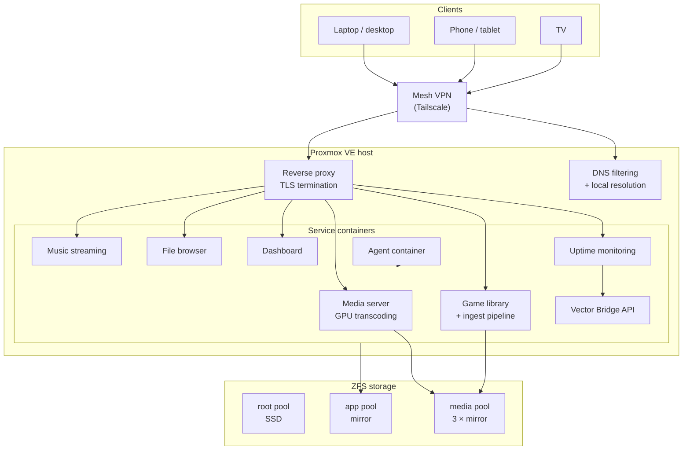

# Homelab

A self-hosted virtualization platform running on a single enterprise server: 16 Linux containers and 2 virtual machines on Proxmox VE, backed by ZFS, reachable from anywhere over a mesh VPN, and monitored end to end.

I built it because I wanted to understand infrastructure by running it, not by reading about it. Everything here is in daily use — when something breaks, I'm the one who fixes it.

---

## Hardware

| Component | Spec |
|---|---|
| Platform | Supermicro dual-socket server board |
| CPU | 2 × Intel Xeon E5-2620 v2 — 24 threads across 2 NUMA nodes |
| Memory | 224 GB DDR3 ECC registered |
| Boot / root | 256 GB SATA SSD |
| Bulk storage | 6 × 3 TB enterprise SAS/SATA, three 2-way mirrors — 8.2 TB usable |
| Application storage | 2 × 3 TB mirror — 2.7 TB usable |
| GPU | NVIDIA Quadro P1000 for hardware video transcoding |
| Hypervisor | Proxmox VE 9 on Debian 13 |

### Two hardware problems worth documenting

**The GPU didn't fit.** The board's PCIe slots are x8 and closed-ended, and the card is a physical x16. Electrically, an x16 card runs fine in an x8 slot — it just negotiates fewer lanes — so the only real obstacle was the plastic stop at the back of the slot. I cut the slot open so the card could seat, verified it enumerated at Gen3 x8, and confirmed the transcode path end to end. It has been stable since.

**Driver and kernel pinning.** The P1000 is Pascal-generation, and NVIDIA's 580 branch is the last one that supports it. Several 580 point releases fail to compile against the running kernel, so the driver is installed via the `.run` installer with DKMS and a specific version pinned. Device nodes are created at boot through a systemd oneshot rather than relying on a module load side effect.

### Storage layout

ZFS, chosen over hardware RAID for checksumming, snapshots and the ability to see exactly what the pool is doing.

- **Mirrors instead of RAIDZ.** For a pool that hosts running containers, mirrored vdevs give better random I/O and much faster resilvering. Wider parity would have bought capacity I didn't need at the cost of latency I would have felt daily.
- **ARC capped** so the cache can't starve the containers on a box where memory is shared with workloads.
- Separate pools for root, applications and bulk data, so a full media pool can never take the hypervisor down with it.

---

## Architecture

Every service runs in its own unprivileged LXC container. Containers are small, independently restartable, and snapshot before I change anything. Remote access goes through a mesh VPN rather than open ports, so there is no public attack surface to maintain.

---

## Services

| Service | What it does | Stack |
|---|---|---|
| **Media server** | Streaming for me and for family and friends, with individual accounts and hardware-accelerated transcoding so older client devices get a stream they can actually play | Jellyfin, NVIDIA NVENC |
| **Game library** | Browser-based game library and a streaming path for titles that can't run in a browser, with an automated ingest pipeline behind both | Python, nginx, EmulatorJS |
| **Music streaming** | Multi-user music service with its own library and accounts | Self-hosted, LXC |
| **Dashboard** | One page linking every service, with live status per tile | Homarr |
| **Monitoring** | Per-service health checks, history and alerting | Uptime Kuma |
| **Vector Bridge** | An HTTP API that lets a desk robot answer questions about the server out loud, and run a fixed set of approved operations | FastAPI, systemd |
| **Agent container** | A sandboxed container where an AI coding agent can build and deploy on the server without touching the hypervisor | LXC, scoped mounts |
| **File browser** | Web file access to the application storage pool | Filebrowser Quantum |
| **Reverse proxy** | TLS termination and routing to every web service | Nginx Proxy Manager |
| **DNS** | Network-wide filtering and local name resolution | AdGuard Home |

---

## Engineering write-ups

Each of these is its own page, with the design decisions and the failures that shaped them.

- [Networking and remote access](docs/networking.md)
- [Storage and hardware](docs/storage.md)
- [Media server](docs/media-server.md)
- [Game library and ingest pipeline](docs/game-library.md)
- [Monitoring and the Vector Bridge](docs/monitoring.md)
- [Agent container](docs/agent-container.md)

---

## Problems I fixed

**Intermittent 502s that only happened sometimes.** A web service behind the reverse proxy would fail for minutes at a time and then recover on its own. The proxy's ARP cache turned out to be resolving the container's address to a completely different physical machine: the container's static address sat inside the router's DHCP pool, and another device had been handed the same one. I found it by comparing the MAC the proxy had cached against the container's real MAC, then confirming it in the router's lease table. Fixed by reserving the address to the container's MAC and shrinking the DHCP pool so static assignments live outside it. The general lesson — static addresses inside a DHCP range are a time bomb — now applies to every address on the network.

**Real client IPs were lost through two proxy layers.** Requests traversed two proxies before reaching the application, so everything logged as coming from localhost, which broke per-user visibility. Fixed by configuring trusted-proxy ranges explicitly at each hop so the original client address is preserved instead of guessed.

**DNS that died whenever the VPN did.** Client DNS pointed at a resolver reachable only over the mesh VPN, so anything that interrupted the tunnel took name resolution with it — including the client's ability to reconnect the tunnel. Rebuilt as a layered setup: an encrypted public resolver at the adapter level as the floor, with the VPN overriding DNS to the internal resolver whenever the tunnel is up. Both states now work independently.

**A monitoring container that kept dying quietly.** Intermittent DNS failures traced back to the resolver container being killed for exceeding its memory limit with no swap, restarting fast enough that it looked healthy. Raising the limit fixed it; the real lesson was that "the service is running" and "the service has been running continuously" are different questions, which is why uptime monitoring now watches it.

---

## What I'd do differently

- **Put statics outside the DHCP pool from day one.** One bad address cost me more debugging time than the entire initial build.
- **Monitoring before services, not after.** Several problems above were running for weeks before anything told me.
- **Plan GPU fitment before buying.** The slot modification worked, but checking the slot geometry first would have been free.
- **VR game streaming stayed on the desktop.** I prototyped hosting it from the server and measured the latency. Added network hops plus encode/decode overhead made it noticeably worse than running it locally, and no amount of tuning was going to beat physics. It runs on the desktop, and the server does what the server is good at.

---

## Skills this represents

Linux administration · virtualization and container orchestration · ZFS storage design · network architecture, DNS and reverse proxying · TLS and certificate management · GPU passthrough and hardware transcoding · Python services and systemd · monitoring and alerting · hardware troubleshooting and repair
