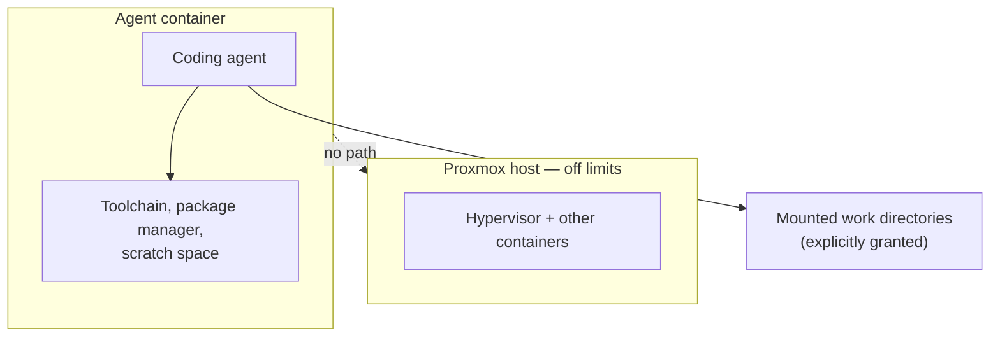

# Agent Container

A dedicated container where an AI coding agent can build, deploy and troubleshoot services on the homelab — without being able to reach the hypervisor or anything it hasn't been given.

## Why

A lot of what runs here was built with AI assistance: I describe what I want, an agent writes a first pass, and I review, correct and integrate it. Doing that well means the agent needs to actually run things — install packages, start services, read logs — because an agent that can only write code and never test it produces code that looks right and isn't.

The obvious way to grant that is to hand over root on the host. That's also the way to find out what a confidently wrong command does to a production hypervisor.

## The design

The principles:

**Its own container, unprivileged.** The agent operates inside a boundary the hypervisor enforces, not one the agent is trusted to respect.

**Explicit mounts only.** It sees the directories it has been given and nothing else. Granting access to a new area is a deliberate act.

**No hypervisor access.** It cannot create, destroy, or reconfigure containers, including its own. The blast radius of any mistake is one container I can rebuild.

**Changes I care about go through review.** For anything touching a running service, the pattern is propose, review, apply — the same thing I'd want from a human contributor with commit access.

## What this taught me

**The right question isn't "can I trust it," it's "what happens if I'm wrong."** A capable agent with narrow permissions is more useful than a cautious one with broad permissions, because the first failure mode is recoverable and the second isn't.

**Constraints improve the output.** Making the agent work inside a defined space forces the work to be explicit about what it touches — which is also what makes it reviewable.

**This generalizes.** The same reasoning shows up in the [Vector Bridge](monitoring.md): authenticate the caller, allowlist the operations, gate anything that changes state, fail closed on anything unrecognized. Automation is only as safe as the boundary you put around it, and the boundary is the part worth designing.
