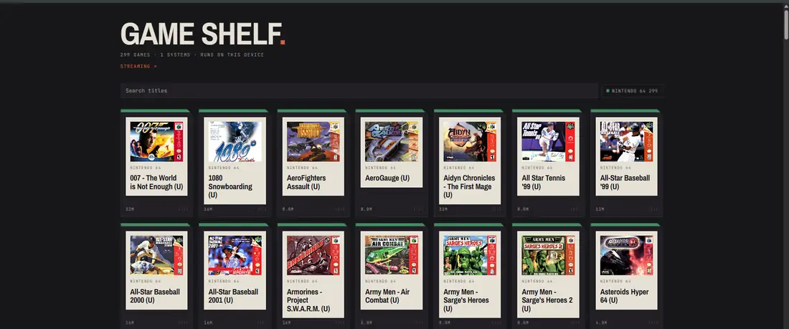
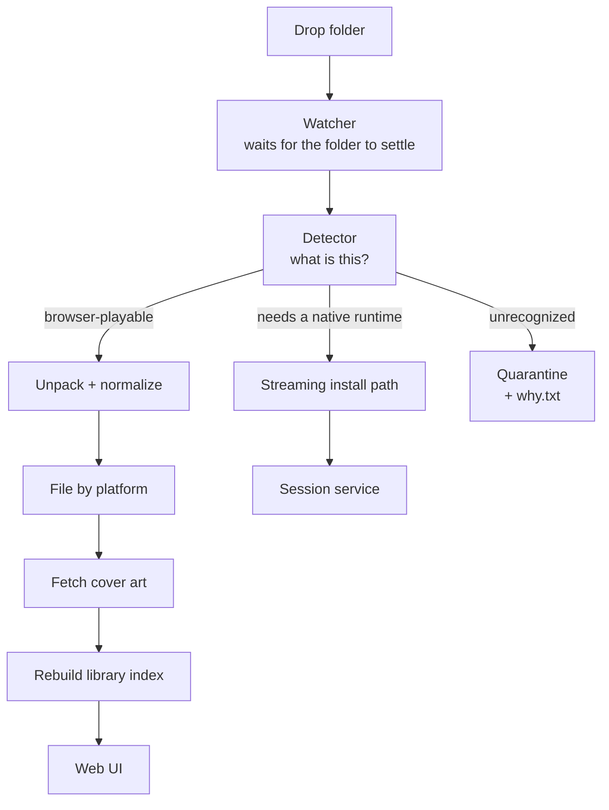

# Game Library and Ingest Pipeline

A browser-based game library served from the homelab, plus a streaming path for titles that can't run in a browser, plus the automated pipeline that gets things onto the shelf without me touching them.

The interesting part isn't the front end. It's what happens between "a folder appears" and "a playable entry with cover art shows up in the UI."

## The pipeline

Every stage runs as its own systemd service, so one stage failing doesn't take down the others, and each restarts on its own.

### Waiting for the folder to settle

A folder that's still being written is a folder you can't classify. The watcher polls for size and mtime stability across consecutive checks before touching anything, which eliminated a whole category of "it worked when I did it by hand" bugs.

### Detection

A shared detection module answers one question — what can actually run this? — and everything else keys off its verdict. It recognizes cartridge image formats across roughly 25 platforms by extension and content, identifies browser-capable engines by their characteristic file layouts, spots native Linux builds, and returns "no" when nothing matches.

Putting detection in one module rather than duplicating it in each stage matters: when detection improves, every stage improves at once.

### Unpacking

Real-world archives are nested: an archive inside a disc image inside an installer. The unpacker recurses with a depth limit, and it reads installers rather than executing them — running an unknown binary to see what's inside it is not a thing I want a background service doing.

One hard-won detail, documented in the code so I don't relearn it: the distribution's default archive tools fail outright on multi-volume archive sets, one with an unsupported-method error and the other by simply not handling them. The pipeline uses the upstream vendor's tool for those, installed separately.

### Quarantine, with an explanation

Anything the detector rejects goes to a quarantine folder alongside a `<name> — why.txt` saying what was found and why it wasn't usable. This turned out to be one of the best decisions in the whole system. Silent failure means digging through logs weeks later; a note in the folder tells me immediately whether the file is unusable or the detector needs work.

### Cover art

An art fetcher matches each entry against a public artwork archive. Filenames in the wild are inconsistent, so matching is fuzzy rather than exact, and it checks inside the game's own files first before going to the network. Misses are recorded with a timestamp and retried on a long backoff rather than hammered on every run, and the whole thing can be told to run with no network at all.

### Index and serve

A scanner walks the library and writes a JSON index the front end consumes: platform, display name, emulator core, artwork path. The UI reads the index rather than the filesystem, so page loads don't depend on directory walks. Platform metadata — which emulator core handles which system, and each platform's display name and color — lives in one table in the scanner.

## Session authentication

Part of the library sits behind a login. Rather than bolting authentication into the application, a small Python service answers a single question for the web server — is this request allowed, yes or no — and the web server enforces the answer before the request ever reaches the content.

Design decisions in that service:

- **Sessions live in memory only.** A restart logs everyone out. That's the behavior I want: no session store to leak, no stale tokens surviving a reboot.
- **Passwords are salted and hashed,** compared with a constant-time function so timing doesn't leak information.
- **Idle timeout is configurable** and enforced server-side, not by the client.

## Streaming path

Titles that can't run in a browser get installed into a separate tree for a streaming service to launch, with ownership set for the account that service runs as. A dedicated stage handles this, because the cartridge-oriented sorter used to grab these and file them incorrectly — an early bug where the fix was recognizing that two different kinds of thing needed two different pipelines rather than one pipeline with more special cases.

## What I'd change

- Core modules are published in [`scripts/game-library/`](../scripts/game-library/).
- The detector's verdicts and the sorter's destinations grew organically and would be cleaner as an explicit state machine.
- There's no test suite. It's the right size for one, and the detector in particular is pure input-to-verdict logic that would be easy to cover.
- Several `.bak` files from past refactors sit next to the live scripts. That's what version control is for, and it's why this lives in git now.
