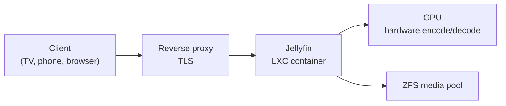

# Media Server

A self-hosted streaming service running in its own container, with individual user accounts for family and friends and GPU-accelerated transcoding so the stream matches whatever device is asking for it.

## Why self-host it

I wanted one library, accessible on every screen I own, that doesn't disappear when a licensing deal expires and doesn't depend on a subscription staying affordable. Running it myself also meant learning the parts that make streaming actually work: transcoding, client capability negotiation, and reverse proxying a long-lived connection.

## Architecture

The service runs in an unprivileged LXC container with the GPU device passed through and the media pool bind-mounted read-only where it can be.

## Hardware transcoding

Software transcoding on these CPUs is a non-starter: a single 1080p stream can saturate multiple cores, and two concurrent streams would bring the machine to its knees. The GPU has dedicated encode and decode silicon that does the same work at a fraction of the power, leaving the CPUs free for everything else on the box.

Getting it working inside an unprivileged container took three things that all have to line up:

1. **Driver on the host,** at a version that supports this GPU generation and compiles against the running kernel.
2. **Device nodes present at boot,** created deterministically through a systemd unit rather than as a side effect of something else loading.
3. **Passthrough into the container,** exposing the right device nodes with the right ownership, since the container's user IDs are offset from the host's.

Each layer fails differently. The driver failing is loud. Missing device nodes look like the GPU not existing. Wrong ownership inside the container looks like a permissions error on a device that's clearly there. Knowing which layer to check first is the part that comes from doing it.

## Users and access

Family and friends get their own accounts, which means their own watch state, their own resume positions and their own recommendations rather than sharing one login and stepping on each other. Access goes through the reverse proxy over TLS.

## What I learned

**Client capability negotiation is most of the battle.** Whether a stream transcodes at all depends on what container, codec, bitrate and subtitle format the client can handle natively. The wrong client setting can force a transcode that direct play would have handled for free, and the fix is usually in the client rather than the server.

**Long-lived connections need different proxy settings than web pages.** Default proxy timeouts are tuned for short request/response cycles, and a video stream is neither.

**Storage layout shows up in playback.** Media lives on mirrored vdevs partly because seeking through a large file while another stream is being written is exactly the mixed workload that punishes a parity array.
