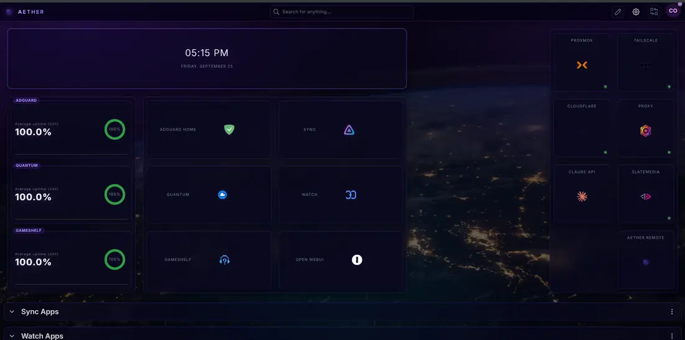
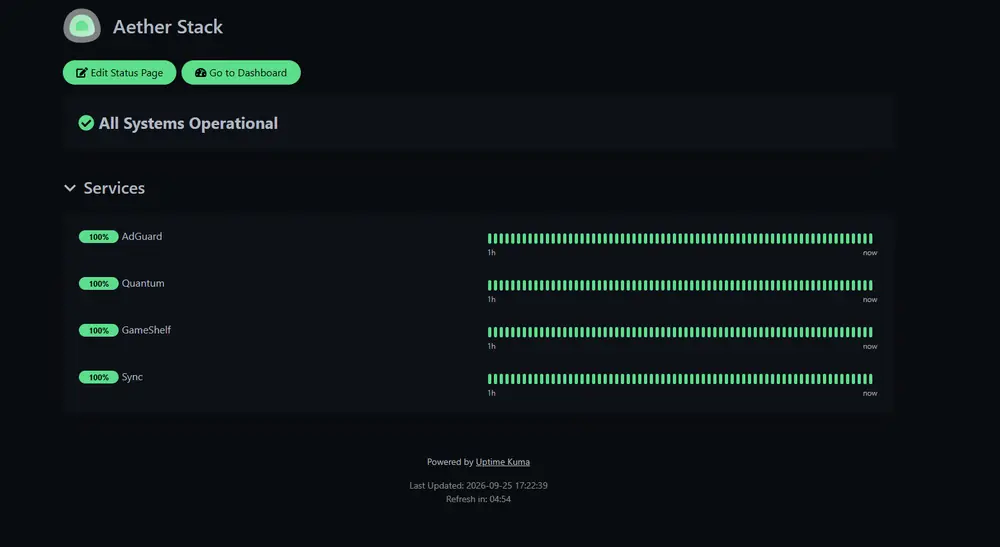

# Monitoring, Dashboard, and the Vector Bridge

Three layers of "is everything okay": a dashboard I look at, a monitor that watches when I don't, and a desk robot that tells me out loud when I ask.

## Dashboard

A single page linking every service, each tile showing live status. It's the browser home page on every device I use, which means the first thing I see each day is whether anything is red.

The value isn't the links. It's that a service being down is visible passively, without me deciding to go check.

## Uptime monitoring

Per-service health checks on a schedule, with history and alerting.

What I learned to watch, after being burned by each:

- **Not just "is the port open."** A service can accept connections and still be broken. Checks hit an endpoint that exercises the actual path where one exists.
- **Restart count, not just current state.** A container that's being killed and restarting quickly looks healthy at every spot check. That exact failure caused intermittent DNS problems for days before anything caught it.
- **Dependencies get their own checks.** When one service depends on another, monitoring only the top of the chain means diagnosing from the least informative symptom.

## Vector Bridge

I have an Anki Vector — a small desk robot — and I wanted to ask it how the server was doing rather than opening a dashboard. The bridge is the service that makes that possible: a small FastAPI application that accepts a command, and either answers it or refuses.

The engineering interest here is not the robot. It's that this is a voice interface to infrastructure, and voice interfaces to infrastructure are a bad idea implemented carelessly. Speech recognition is unreliable in exactly the ways that matter — it garbles container names, numbers, and anything that isn't a common English word — so the design starts from the assumption that the input cannot be trusted.

### How it's constrained

**Every request is authenticated.** A shared token is checked on the command endpoint before anything else happens. Wrong token, 401, nothing runs.

**Read-only operations are a fixed dispatch table.** Status, disk space, uptime, load. A command either matches a key in that table or it doesn't. There is no path from spoken words to a shell.

**Write operations come from a named allowlist,** defined in a separate YAML file with fixed parameters. The robot matches a phrase to an entry; it never assembles a command. The file says so at the top, in a comment written to the next person who edits it:

> Never build these from speech — the transcriber cannot reliably handle repo names, URLs, or container IDs. Define each operation here with fixed parameters.

**Anything that changes state goes through an approval gate.** A matched write operation isn't executed by the bridge. It's submitted to an existing approval service, and the bridge only reports back what that service says. The robot cannot unilaterally change anything.

**Unknown commands fail closed.** No fuzzy matching, no "did you mean." An unrecognized phrase gets "I don't know that one."

### Implementation details worth noting

- **Behavior control is always released.** Making the robot speak requires taking control of its behavior stack from the firmware. That's acquired, used, and released in a `finally` block, so a failure mid-speech doesn't leave the robot frozen and unresponsive to its own firmware.
- **Network calls have timeouts and catch their own failures.** Nothing here should hang, and an unreachable monitor produces "I couldn't reach the monitor" rather than a stack trace and a dead request.
- **Approval submission runs on a background thread,** so a long-running approved operation doesn't hold the HTTP request open — the robot speaks the result when it arrives.
- **Configuration comes from the environment,** with the token required and everything else optional. A missing optional piece degrades to a spoken "that isn't set up" rather than a crash.

The sanitized source is in [`scripts/vector-bridge/`](../scripts/vector-bridge/).

### What I'd add

Rate limiting on the command endpoint, and structured logging of every command received and every decision made. Right now if something odd happened, I'd be reconstructing it from service logs rather than reading an audit trail.
