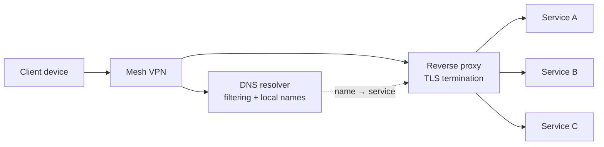

# Networking and Remote Access

Everything I host is reachable from anywhere I am, and nothing is reachable from the open internet by default. That constraint shaped every decision below.

## The model

Three pieces do the work:

**Mesh VPN.** Every device I own joins a private network with its own address space. Devices talk directly to each other wherever possible, falling back to a relay only when a network blocks direct connections. There are no port forwards to maintain and no login page exposed to the world — a device is either on the mesh or it isn't.

**Reverse proxy.** One entry point terminates TLS and routes by hostname to the right container. Certificates are issued and renewed automatically. Adding a service means adding a proxy entry, not opening another hole.

**DNS.** A resolver on the network handles filtering and local name resolution, so the same hostname works whether I'm at home or away. Upstream queries are encrypted.

## Per-service isolation

Each service runs in its own unprivileged LXC container. That means:

- A compromise or a runaway process is contained to one service.
- I can restart, snapshot, or rebuild any single service without touching the others.
- Resource limits are per container, so one misbehaving service can't starve the rest.

Unprivileged containers do come with real constraints. VPN clients inside them need explicit TUN device passthrough before they'll start — a detail that cost me an evening the first time and thirty seconds every time since.

## Things that broke, and what they taught me

### Static addresses inside a DHCP pool

**Symptom:** one web service behind the reverse proxy would return 502 for a few minutes at a time, then recover on its own. Nothing in the service's own logs showed a problem.

**Diagnosis:** the proxy's ARP cache had a MAC address for that service that didn't match the container's actual MAC. The address belonged to an unrelated physical machine on the network. Every request the proxy sent during that window went to the wrong box.

**Root cause:** the container's static address sat inside the router's DHCP pool, and the router had eventually handed the same address to another device.

**Fix:** reserved the address to the container's MAC, then shrank the DHCP pool so every static assignment lives outside it.

**Lesson:** a static address inside a DHCP range works right up until it doesn't, and the failure looks like an application bug. I now check pool boundaries before assigning anything.

### Losing the real client IP through two proxy layers

**Symptom:** an application logged every request as coming from the proxy rather than the actual client, which made per-user visibility useless.

**Cause:** two proxy layers in front of the application, neither configured to trust the other, so forwarded-for headers were dropped rather than chained.

**Fix:** explicit trusted-proxy ranges at each hop, with the literal upstream listed rather than a wildcard. Trusting everything would have "fixed" the logs while letting any client spoof its own address.

### DNS that depended on the thing it was needed to restore

**Symptom:** when the VPN tunnel dropped, name resolution stopped entirely — including the resolution needed to bring the tunnel back up. A full circular dependency.

**Cause:** client DNS pointed at an internal resolver only reachable over the mesh, and a VPN setting that overrode DNS for all domains system-wide even while the tunnel was down.

**Fix:** a layered approach. The network adapter uses an encrypted public resolver as its floor, so name resolution works on any network with the tunnel down. When the tunnel comes up, the VPN's own DNS override points at the internal resolver. Both states were verified independently, including that the override clears cleanly when the tunnel is taken down.

**Lesson:** any dependency chain that loops back on itself will eventually deadlock. Ask what restores the system when the system is down.

### A resolver being killed and restarting too fast to notice

**Symptom:** intermittent DNS failures on one client, with nothing obviously wrong at the resolver.

**Cause:** the resolver container was being killed for exceeding its memory limit — with no swap configured, the kernel had no gentler option — and restarting quickly enough that any spot check found it healthy.

**Fix:** a higher limit for the container, and a monitor that tracks restart count rather than just whether the process is up.

**Lesson:** "it's running" and "it has been running the whole time" are different questions, and only one of them is useful.
